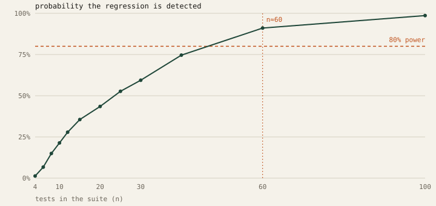

# How many tests does an LLM eval suite need?

*An empirical power analysis of regression detection, measured with
EvalBench on real model outputs.*

Run 2026-09-07 · suite `research-power.yaml` (30 tests) ·
baseline `openai/gpt-oss-120b` · candidate `allam-2-7b`

---

## Question

Teams gate deploys on eval suites, and those suites are usually small —
a dozen prompts, maybe thirty. When such a suite reports "quality
dropped", how often is that verdict trustworthy? And how many tests does
it actually take before a real regression is reliably caught?

## Method

1. A 30-test suite spanning factual recall, arithmetic, multi-step
   reasoning, structured output and definitions was run once against two
   models of clearly different capability. Only deterministic,
   locally-graded assertions were used, so measured variance comes from
   the model under test rather than from an LLM judge.
2. The observed effect was a mean per-test score difference of
   **-0.230** (0.838 → 0.608).
3. For each suite size *n*, 2000 bootstrap resamples of *n*
   test-pairs were drawn with replacement, and EvalBench's own regression
   detector was run on each. The proportion of draws reporting a
   regression is the empirical **statistical power** at that *n*.

## Result



| tests (n) | detector power | t-test significant |
|---:|---:|---:|
| 4 | 1% | 1% |
| 6 | 7% | 7% |
| 8 | 15% | 15% |
| 10 | 21% | 21% |
| 12 | 28% | 28% |
| 15 | 36% | 36% |
| 20 | 44% | 44% |
| 25 | 53% | 53% |
| 30 | 59% | 59% |
| 40 | 75% | 75% |
| 60 | 91% | 91% |
| 100 | 99% | 99% |

**Power reaches 80% at the smallest measured size n = 60** (the grid
jumps 40 → 60, so the true crossing sits between them).

The two columns are identical at every size, which is itself a result:
the detector gates on *both* `p < 0.05` and a mean drop of more than
0.05, and for an effect this large the magnitude gate never binds. Every
resample the t-test called significant was also large enough to flag.
Power here is therefore bounded purely by sample size, not by the
detector's threshold.

## Findings

**1. Small suites miss real regressions.** At n = 10 the detector fires
only 21% of the time on an effect this size. A team running a
ten-prompt suite would miss the same genuine degradation four times in
five — and would reasonably conclude nothing had changed.

**2. The failure is silent and asymmetric.** A small suite rarely
produces a *false* regression; it produces a false sense of safety. That
is the more dangerous direction for a deploy gate, because the failure
mode is "ship it" rather than "investigate".

**3. EvalBench's own advice is conservative.** For this effect the tool
reported `min_samples_for_5pt_mde = 943`, derived from a
normal-approximation power calculation targeting a 5-point shift. The
observed effect here is larger than 5 points, so the empirical
requirement (60) is correspondingly smaller. The analytical figure is
a safe upper bound rather than a tight one — useful as a floor when
sizing a suite, not as a prediction.

**4. Effect size matters more than sample size alone.** Cohen's d for
this comparison was **-0.4202**. Power is a function of both; a
suite adequate for catching a model swap will still be blind to a subtle
prompt change. Reporting the effect size alongside the p-value — as
EvalBench does — is what makes that visible.

## Implication

The practical guidance is uncomfortable: **the eval suite most teams have
is too small to gate on.** A suite that cannot detect the regressions it
exists to catch provides assurance without evidence.

Two mitigations follow directly, both of which EvalBench implements:

- Report a **confidence interval** on the pass rate, not a bare number,
  so overlap is visible at a glance.
- Report the **required sample size** next to the verdict, so "no
  regression detected" can be read as "not detectable at this n" rather
  than "no regression exists".

## Limitations

- One effect size, one model pair, one task distribution. The absolute
  numbers do not transfer; the shape of the curve and the direction of
  the bias do.
- Bootstrap resampling from 30 real tests approximates a larger suite
  drawn from the same distribution. A genuinely larger suite would add
  task diversity this method cannot simulate.
- Assertions were deterministic by design. Suites relying on an LLM
  judge carry additional grader variance, which would shift the curve
  right.

## Reproducing

```bash
python scripts/run_study_power.py --resamples 2000
```

Raw paired scores and the full curve are in `power-study.json`.
