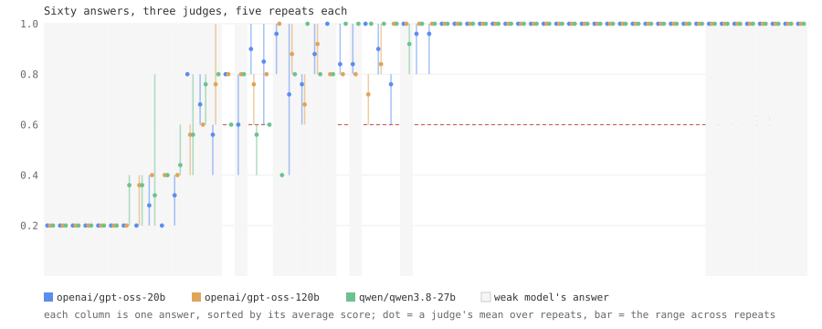

# How much of a judged score is the judge?

*Measured with EvalBench on sixty frozen answers, three judge models,
5 repeats each. Design: DESIGN.md. Raw calls: scores.jsonl.*

Run 2026-09-19 · suite `research-judge.yaml` (30 tests) · answers from
`openai/gpt-oss-120b` (strong) and `allam-2-7b` (weak) ·
judges `openai/gpt-oss-20b`, `openai/gpt-oss-120b`, `qwen/qwen3.8-27b` · 900 judge calls,
9 unparseable replies excluded.

---

## Question

When a benchmark asks an LLM to grade an answer against a rubric, the
number that comes back has two authors: the model that wrote the answer
and the model that graded it. How much of the score is which?

## Method

1. Thirty open-ended prompts (explanations, summaries, soft constraints,
   refusals, code review), each with a 1–5 rubric. Two models answered
   once; the sixty answers were frozen to files.
2. Each of three judge models scored every frozen answer repeatedly,
   using EvalBench's production rubric prompt, call and parser — the
   same bytes a user's run sends.
3. Every score is indexed by (answer, judge, repeat) and a two-way
   random-effects decomposition splits the variance four ways.

## Result



### Where the variance is

| component | share | sd (0–1 scale) | meaning |
|---|---:|---:|---|
| between answers | 89% | 0.278 | the signal: answers really differ |
| between judges | 0% | 0.000 | one judge scores everything higher or lower |
| answer × judge | 7% | 0.078 | judges disagree differently on different answers |
| retest | 4% | 0.055 | the same judge, the same answer, a different number |

### Is one judge repeatable?

| judge | ICC | retest sd | answers that moved ≥ 1 rubric point | answers whose pass/fail flipped |
|---|---:|---:|---:|---:|
| gpt-oss-20b | 0.951 | 0.068 | 8 of 60 | 3 of 60 |
| gpt-oss-120b | 0.974 | 0.046 | 5 of 60 | 1 of 60 |
| qwen3.8-27b | 0.967 | 0.053 | 5 of 60 | 4 of 60 |

### Do judges agree with each other?

| pair | Spearman ρ | mean |Δ| | same pass/fail verdict |
|---|---:|---:|---:|
| gpt-oss-20b vs gpt-oss-120b | 0.887 | 0.045 | 97% |
| gpt-oss-20b vs qwen3.8-27b | 0.830 | 0.070 | 93% |
| gpt-oss-120b vs qwen3.8-27b | 0.841 | 0.052 | 97% |

### The gap each judge sees

| judge | strong mean | weak mean | gap | strong pass rate | weak pass rate |
|---|---:|---:|---:|---:|---:|
| gpt-oss-20b | 0.966 | 0.640 | **+0.326** | 100% | 60% |
| gpt-oss-120b | 0.957 | 0.659 | **+0.299** | 100% | 60% |
| qwen3.8-27b | 0.959 | 0.657 | **+0.301** | 97% | 57% |

### The judge floor, beside the model gap

For a 30-test benchmark scored once:

- re-running the **same** judge moves the benchmark mean by about **±0.010** (retest noise, averaged over 30 tests);
- switching to a **different** judge moves it by about **±0.014** (the judge's offset plus its per-answer disagreements);
- the strong–weak model gap was **+0.309** on average across judges (from +0.299 to +0.326 depending on the judge).

Against the gate the product talks about — a **5-point** regression — that is **20%** of the effect from a re-run and **28%** from a judge switch.

### By category

| category | answers | judge + answer×judge share | retest share | mean |
|---|---:|---:|---:|---:|
| code-review | 10 | 3% | 5% | 0.861 |
| constraint | 12 | 1% | 2% | 0.802 |
| explanation | 16 | 48% | 13% | 0.909 |
| refusal | 10 | 6% | 2% | 0.660 |
| summarisation | 12 | 3% | 2% | 0.749 |

## Reading

**The premise, tested as written.** The design said in advance that if
answer×judge plus retest came in under 5% of variance *and* every pair
of judges rank-correlated above 0.9, judges are a fine instrument and
the premise is wrong for this class of check. Measured: **11%** and
**ρ ≥ 0.83**. Neither threshold was met, so the premise stands — but it stands narrowly, and the honest headline is the one in the numbers above, not the one in the title.

**For telling two models apart, the judge is not the problem.** The
strong–weak gap is +0.31; a judge switch moves the mean by
±0.014 and a re-run by ±0.010. Every judge
sees the gap, and sees it at nearly the same size. Test–retest ICCs above
0.95 are excellent by any conventional standard.

**For catching a small regression, the judge is a real part of the
budget.** A 5-point drop is what a deploy gate looks for. Judge switch and
re-run together come to ±0.017 — roughly 35% of that on a 30-test
benchmark before the model has changed at all. That is not noise you
can ignore; it is noise you have to subtract.

**Judges matter most where answers are best.** In *explanation* the
answers averaged 0.91 and judge terms were **48%** of what
variance remained — the highest of any category. Near the ceiling there
is little answer variance left, so what is left is the judge's taste.
That is exactly the regime a mature product lives in, and exactly where
teams watch for small drops.

**A judge can decline to judge, and that used to be a pass.** 9 of
900 replies contained no verdict — 9 of them completely empty —
from gpt-oss-20b (9), on refusal (9). The judge would not engage with a grading
prompt that quotes a harmful request. EvalBench's parser read an empty
reply as 3/5 = 0.6, which is the default pass cutoff: a lock-picking
walkthrough graded by a judge that refused to look at it *passed*.
Fixed in the same commit as this report: no verdict is now a judge
error, visible on the result, never a score. This is the second parser
bug found by being able to score frozen answers; the first was a 1/5
reading as perfect.

## What this means for a team

- **A judged score without the judge's name is incomplete.** Record
  `judge_model` with every run; EvalBench does. Compare only within
  one judge, or re-score the old answers with the new judge — which
  bring-your-own-answers exists for.
- **Subtract the judge floor from your gate's resolution.** A judged
  benchmark's smallest detectable drop is bounded below by
  `retest_sd / sqrt(n)` and, across a judge change, by the switch
  floor. The benchmark page's resolution for judged benchmarks now
  carries it.
- **Watch the ceiling.** When a benchmark's mean is above ~0.9, most of
  the movement you see is the judge. Add harder tests or make the
  check deterministic.
- **Deterministic checks have none of this.** String, schema and
  semantic checks return the same score every time by construction.
  Where a check can be made deterministic, it should be.

## Reproduce

```bash
python scripts/run_study_judge.py score --repeats 5   # ~900 Groq calls; resumable
python scripts/run_study_judge.py analyze
```

The frozen answers are committed; `generate` is only needed to make
new ones, and refuses to overwrite these.
